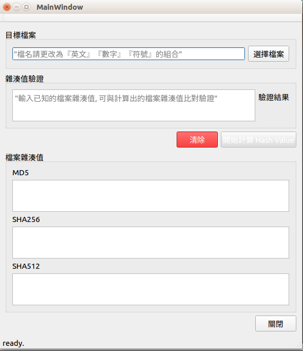
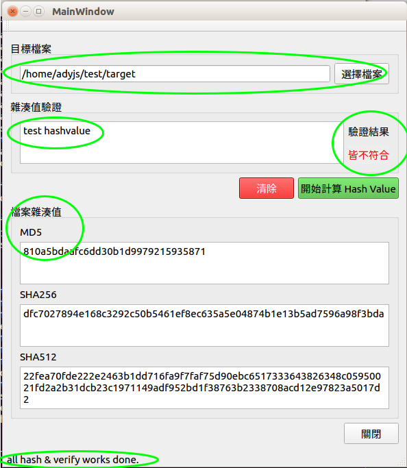

# Qt checksum machine

作者 ＆ 使用說明

使用者您好, 

使用方法：

首先選擇你要驗證的檔案, 檔名請保持『英文』『數字』『符號』的組合,

因為目前程式的限制, 所以如果是『中文或其他語系』的檔名可能會造成程式無預期的關閉,

接著可以輸入已知的檔案雜湊值, 當按下 Hash 按鈕時, 等到檔案雜湊值計算出來之後, 就會自動比對驗證雜湊值,
完成之後可以直接選取別的檔案, 或者按清除按鈕之後在重新操作。

這個 checksum machine 應用程式是我的學習 Linux Programming 的一個小練習作品,
是從學習「C 語言,「多執行序,「Linux 作業系統」的過程中所延伸出來的東西,

製作主要是之前用過 windows 上面的一個小程式 MD5 & SHA Checksum Utility,
用法很簡單明瞭, 因此想要自己在 linux 上做一個類似的程式, 在寫完 C 語言版本的 checksum machine 之後, 想著如何把它做成日常看到的小型圖形的桌面程式，
接著就學習 Qt 及 C++ 基礎語法, 並把 C 語言版本的 porting 到 Qt 上, 也就是現在這個小程式。

Author:Adyjs
email:adyjsdev@gmail.com

