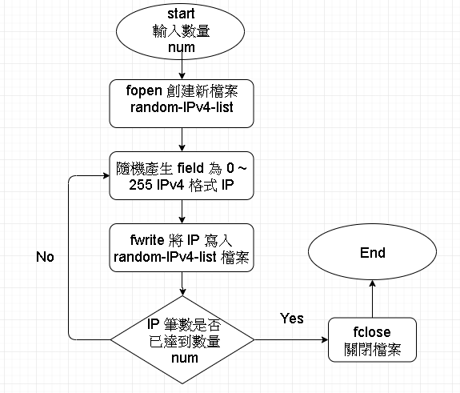
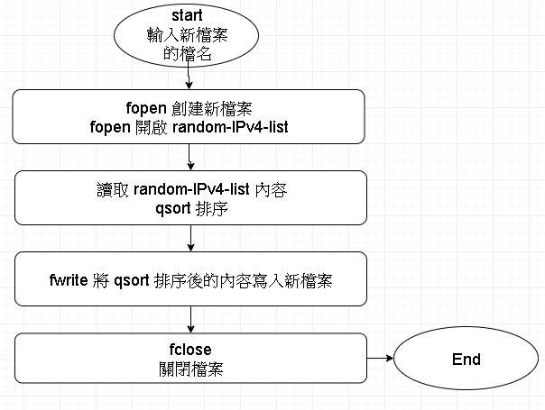

# IPv4 list generator and file io with sorting 
# IPv4 隨機產生器 及 IPv4 文件排序器


### 初始化
```
git clone this repository

cd this repository directory

make

執行 makefile 之後 , 你可以得到 file-io 及 IPv4-random-list 這兩個可執行檔
```

### 產生一隨機 IPv4 檔案
```
首先執行 IPv4-random-list 後面加上數字 , 數字就是想要產生的 IPv4 IP 的數量

ex.
./IPv4-random-list 10

即產生一檔名為 random-IPv4-list 普通檔案 , 內容為 10 筆隨機產生的 IPv4 IP
```




### 排序其 IPv4 內容檔案
```
執行 file-io 執行檔 , 後面加上一檔名 , 其檔名就是檔案執行後會產生的新檔案 , 內含排序後的 IPv4 IP

ex. 
/file-io output

執行後 , file-io 會讀取同目錄中的 random-IPv4-list 內容 ,
排序內容後 , 將內容另存為一個新檔案

```




