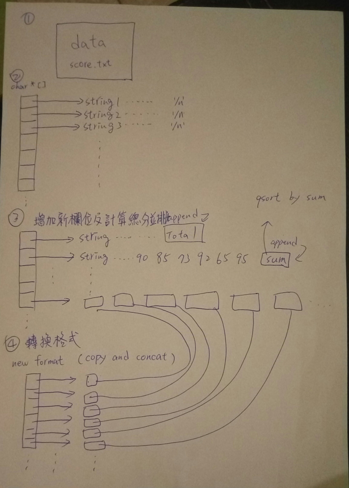

# score sorting and io


```
$ git clone https://github.com/Adyjs/linux-c-dev-practice/tree/master/score-sorting-and-io

then , build code with gcc on windows , need to install mingw
after install mingw , open the windows cli

$ gcc -g -Wall -o run main.c && run

if everything OK , 
you will see a sorted_score.txt created in the score-sorting-and-io directory 


```

本題寫法大略如下

1. 讀入資料後，逐字檢查 '\n' 來計算有幾行

2. 宣告相同數目的 char * 陣列，並且 malloc memory

3. 將 char * 以行數對應 index 方式，把指標指向每一行，
第一行標題，最後再 append 上 Total 字串

4. 第二行以後，計算每一個科目的分數加總，並且把總分 append 在行末

5. 把 char * 陣列作 qsort，以行末的總分來做比較，以大排到小

6. 宣告新格式的 char * 陣列，並把舊格式每一行的字串項目打碎，依照項目 copy and concat 到新格式指標上

7. 最後輸出到 sorted_score.txt 檔案中

8. 結束




